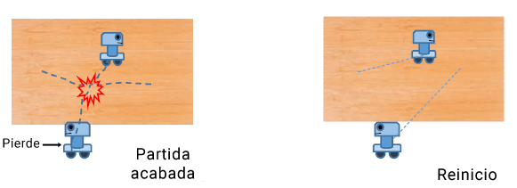

# Reglamento de HEBOCON

  - Revisión 1 (2016): vigente Rev. 1

### Descripción de la prueba
 Es una competición de sumo para robots, una versión modificada del estilo de lucha de sumo japonés.
 La competición está destinada para aquellos que son técnicamente desfavorecidos. Sólo se permite la participación de robots de tipo ["Heboi"](http://portal.nifty.com/hebocon/whats_en.htm)

#### Reglamento básico
 El tablero donde se combate será un contrachapado con un tamaño de 100 x 50 cm.

 Ambos robots comienzan la batalla a la vez desde lados opuestos. No es necesario que sea desde las esquinas.

 

 El primer robot en salirse del tablero es el que pierde, con una excepción. (Ver Reglamento para baja tecnología)

 Si un robot se cae, pierde.

 

 No cuentan como derrota las siguientes situaciones, y por lo tanto la partida debe continuar:
 * Alguna parte del robot, que no está en contacto directo con el suelo, está fuera del tablero.
 * Parte del robot se desprende, quedando esa pieza dentro o fuera del tablero.

 

### Reglamento para baja tecnología

 El reglamento establecido de aquí en adelante se ha concebido con el propósito de dar una oportunidad de hacerlo bien a los robots más imperfectos.

 Excepción: Si un robot se sale del tablero sin que hubiera entrado en contacto con el otro robot, se invalida el combate y se volvería a empezar el enfrentamiento.
 Esta regla tiene el propósito de  evitar estar en desventaja a los robots con mala maniobrabilidad y aquellos que se mueven en línea recta a altas velocidades.
 Esta norma sólo es aplicable dos veces por enfrentamiento. A la tercera vez que suceda, esta norma no se aplica.

 El límite de tiempo del enfrentamiento es de un minuto. Si al llegar a ese tiempo aún no está claro el ganador, este será el que hubiera recorrido una distancia superior. Esta regla tiene el propósito de evitar robots inmóviles.

### Progresión del torneo y premios

 * Los enfrentamientos se llevarán a cabo según la tabla de cruces del torneo.
 * El ganador de cada enfrentamiento se lleva 10 puntos.
 * La penalizacion por incumplir el reglamento de uso de alta tecnología es de 6 puntos por característica en cada enfrentamiento. Normalmente, el ganador de las eliminatorias sería el ganador de la competición, pero si su puntuación total se ve afectada por incumplir las reglas de alta tecnología, podría haber otro ganador si tuviera una puntuación superior.
 * El hecho de participar en una competición de Hebocon es un premio en sí mismo. Es posile que no haya premios materiales, o tal vez juntemos todas las piezas que han ido perdiendo otros robots y te las entreguemos como premio. Simplmente disfruta del momento de Hebocon.

### Especificaciones de los robots

 Por favor, participa con un robot que satisfaga los siguientes requisitos.
 * Es técniamente mediocre. Ver párrafo Reglamento para el uso de alta tecnología, a continuación.
 * No tiene dispositivos que destruyan deliberadamente al oponente, como por ejemplo un taladro eléctrico.
 * El tamaño máximo puede ser de 50cm de ancho por 50cm de largo. No hay limitación en altura y el peso máximo no puede ser mayor de 1 kg.

### Reglamento para el uso de alta tecnología (penalizaciones)

 En caso de que el robot posea algunas de las siguientes características debido a las habilidades de su creador, el creador será penalizado por demostrar unas capacidades técnicas excesivamente altas.

 * Control remoto.
 * Controles automáticos (activaciones automáticas programadas por la obtención de datos de cualquier tipo de sensor, contador de tiempo, medidor de distancia recorrida, etc)
 * Otras cosas que los jueces consideren de alta tecnología.

La penalización sólo será aplicada en las batallas donde la característica de alta tecnología se haya utilizado.

La penalización no será aplicada en caso de que haya una caracteristica de alta tecnología, pero no se haya implementado por las capacidades técnicas de su creador. Por ejemplo, un robot compuesto de un coche de radiocontrol con un disfraz de conejo, puesto que el creador no está relacionado con la creación de ese sistema de control remoto.

Los participantes podrán comprobar con antelación si su robot puede ser penalizado por usar alta tecnología con los organizadores.

La penalización reduce seis puntos por uso de una característica de alta tecnología. En caso de que haya múltiples características de alta tecnología, se rebajarán más puntos.

### Para ir calentanto

 Este es el reglamento, si estás pensando en participar en una competición de Hebocon, por favor asegúrate de leer el documento titulado ["What is Hebocon"](http://portal.nifty.com/hebocon/whats_en.htm). Hebocon no consiste en ganar un torneo, lo más importate aquí es disfrutarlo.

 Esta obra está bajo una [licencia de Creative Commons Reconocimiento 4.0 Internacional (CC-BY)](http://creativecommons.org/licenses/by/4.0/).
 

 
 

 Reglamento extraido de [Hebocon Official Rule](http://portal.nifty.com/hebocon/rules_en.htm).
