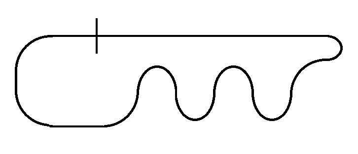

# Reglamento de Sigue líneas

  - Revisión 2 (2016): vigente Rev.2

### Objetivo

Un robot participa para ser el más rápido de un circuíto dado. Cada robot tendrá tres oportunidades de recorrer el circuíto y recibir la mejor puntuación posible en el menor tiempo que pueda.
El reglamento se detalla a continuación.

### Sección 1: Definición

Dentro de un área delimitada de unos 4m², se establecerá un recorrido de una determinada longitud con cinta de color negro de 20 mm de ancho y sobre un fondo blanco completamente liso. Los robots participantes deberán completar el recorrido desde el punto de partida hasta el final en el menor tiempo posible.

### Sección 2: Trazado

El recorrido del circuito es cerrado, los puntos de salida y llegada son el mismo. Tendrá una longitud aproximada de 4 metros e incluye rectas y curvas de diferentes radios. La curva de menor rádio no será inferior a los 125 mm, y la distancia mínima entre dos partes próximas del recorrido no será inferior a los 250 mm.
Las medidas y recorrido del circuito no se darán a conocer hasta el comienzo de la prueba.

*Fig.1 Ejemplo de trazado*

### Sección 3: Reglamentación para los Robots

1. La placa controladora del robot, en caso de haberla, debe estar basada en tecnologías abiertas. También son válidas las plataformas o kits de robótica basados en tecnologías abiertas.
2. El funcionamiento del robot debe ser completamente autónomo. Se puede utilizar cualquier método de control, siempre y cuando esté integrado enteramente en el robot y no reciba señales o indicaciones externas (de cualquier tipo).
3. El robot no puede aprender el recorrido del circuito ni puede programarse para que siga una ruta predeterminada.
4. Los robots deberán tener una masa máxima de 2000 gramos y se recomienda unas medidas máximas que no superen los 250 mm de largo y 150 mm de ancho.
5. El robot debe tener un nombre o número con fines de registro y seguimiento. El robot debe mostrar este nombre o número para permitir su identificación a la organización y jueces y a los espectadores.
6. Los robots deben funcionar únicamente con la energía proporcionada por pilas o
baterías eléctricas integradas en el propio robot.
 
### Sección 4: Puntuación

1. Cada robot puede recorrer el circuito tres veces.
2. El cronómetro de tiempo se pondrá en marcha con el primer movimiento del robot y se detendrá al llegar al final del recorrido.
3. El robot que pierda la línea y no consiga volver al camino correcto en menos de 10 segundos no recibirá un punto ni será contabilizado su tiempo.
4. El robot que se salte parte del recorrido o no siga la línea no recibirá un punto ni será contabilizado su tiempo.
5. El robot que complete todo el recorrido recibirá un punto y será contabilizado su tiempo parcial de carrera.
6. El robot ganador se determina por la mayor acumulación de puntos y el menor tiempo total de recorrido, que viene dado por la suma de sus tiempos parciales.
 
### Sección 5: Categorías de premios

* El robot sigue líneas más rápido según la sección 4 del presente reglamento.
* El robot sigue líneas mejor construido hecho con materiales reciclados.
* El robot sigue líneas más original.
 
### Sección 6: Jueces

En la sala habrá en todo momento una persona identificada como “juez principal” y será la encargada de comunicar cualquier decisión final con respecto al desarrollo de la competición e interpretación de las normas. Otras personas pueden estar identificadas como “juez asistente” y ayudarán al juez principal en las tareas que tenga delegadas.

El participante siempre se debe dirigir al juez principal para cualquier reclamación o aclaración de las normas. Entonces, si el juez principal lo estima oportuno, puede redirigir al participante a un juez asistente.

Las decisiones finales siempre las toma el juez principal.

### Sección 7: Recursos de interese

  * [Tutorial a robot sigue líneas básico](http://todohacker.com/tutoriales/tutorial-robot-siguelineas)

----

Esta obra está bajo una [licencia de Creative Commons Reconocimiento 4.0 Internacional (CC-BY)](http://creativecommons.org/licenses/by/4.0/).

